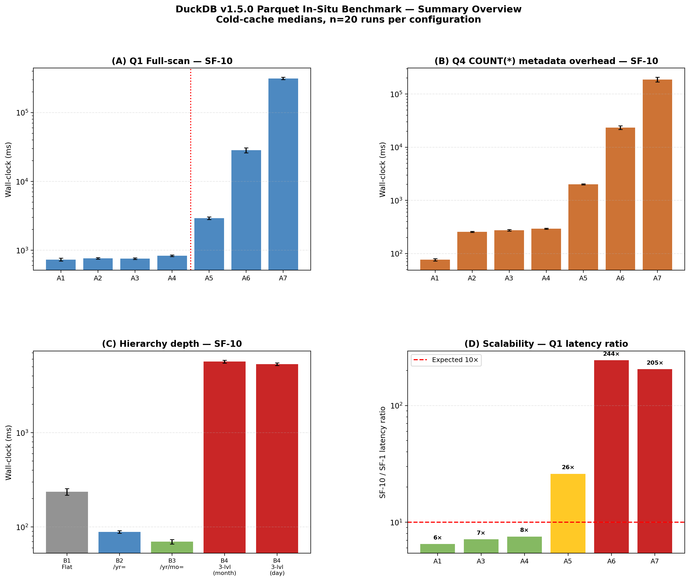

# Analyzing DuckDB's In-Situ Query Performance on Hierarchical and Flat Parquet Layouts

[](https://www.python.org/)
[](https://duckdb.org/)
[](#)
[](LICENSE)

This repository contains the full experimental suite, raw data, and analysis notebooks for the study:  
**"Analyzing DuckDB's In-Situ Query Performance on Hierarchical and Flat Parquet Layouts"** (2026).

The research investigates how different physical arrangements of Parquet files impact the in-situ performance of DuckDB v1.5.0. It evaluates 11 distinct layout models across two TPC-H scale factors (SF-1 and SF-10). Data engineers face a crucial trade-off: partitioning data into hierarchical directories to leverage partition pruning versus the performance degradation caused by the "small file problem".

---

## Overview
Modern Lakehouse architectures often query Parquet files directly without prior ingestion. However, the performance of these queries is highly sensitive to how the data is laid out on disk. This project provides a reproducible framework to evaluate:
* **File Granularity (RQ1):** The impact of file counts versus file sizes on query execution, specifically observing the "small-file problem".
* **Partition Hierarchy (RQ2):** The performance trade-offs of deep Hive-partitioning structures, testing up to three directory levels.
* **Key Ordering (RQ3):** How the order of keys in a hierarchy (e.g., Year/Month vs. Month/Year) affects metadata traversal and pruning latency.
* **Scalability (RQ4):** How layout-induced bottlenecks shift or amplify as the dataset grows from SF-1 to SF-10.
* **Resource Efficiency (RQ5):** The query planning time and peak memory overhead associated with high file fragmentation.

---

## Methodology
The benchmark rigorously evaluates DuckDB's vectorized execution engine using a multi-dimensional set of independent variables (file layouts) and dependent variables (latency, memory, execution time).

### Experimental Environment
* **Hardware:** All tests are conducted on a single Virtual Machine (VM) provisioned with 4 vCPUs, 16 GB of RAM, and an NVMe SSD.
* **Software:** DuckDB v1.5.0 running on Debian 13 (Linux kernel 6.x).

### Execution Protocol
* **Caching Profile:** Each query and model combination is subjected to 20 cold-cache runs. The OS page cache, dentries, and inodes are explicitly flushed before every run to guarantee pure cold-cache measurements.
* **Measurement Metrics:** The benchmark captures wall-clock time, DuckDB-internal execution time, query planning time, and peak RSS memory. Performance is reported using the median of the 20 cold-cache observations.

### Dataset and Scalability
* **Base Schema:** Modifies the standard TPC-H benchmark.
* **Scale Factors:** Evaluates models at SF-1 (~1 GB raw, 6 million rows) and SF-10 (~10 GB raw, 60 million rows) to analyze volume-dependent scalability constraints.
* **Base File Structure:** All Parquet files use a fixed row group size of 1,048,576 rows and ZSTD compression to isolate layout effects from intra-file variations.

### File Layout Models
The experiment synthesizes 11 layout models segmented into three series:
* **Series A (Flat Layouts):** Seven models testing file counts spanning from a single file to 7,500 files at SF-10.
* **Series B (Hierarchical Layouts):** Evaluates partition depths ranging from flat, to shallow (/year/), to three-level deep structures (/year/month/day/).
* **Series C (Inverted Hierarchy):** Tests specific key ordering configurations (e.g., /month/year/).

### Workload
* The suite consists of eight customized SQL queries designed to stress specific execution paths: full scans (Q1, Q6), selective filters (Q2a, Q2b, Q2c), multi-column predicates (Q5), joins (Q7), and metadata collection (Q4).

---

## Results Summary

Our empirical results expose major performance inflection points when operating DuckDB natively on Parquet files:

* **Optimal File Size:** Parquet files sized between 100 MB and 200 MB offer the best balance of fast parallel scan efficiency and minimal metadata management.
* **The File-Count Cliff:** Performance drastically regresses beyond 150 files at SF-10. Full-scan latency drops by 3.5x. For 7,500 fragmented 1 MB files, metadata-only queries execute over 2,400x slower.
* **Memory Overhead Bloat:** High file fragmentation places tremendous memory pressure on the engine. Peak memory scales super-linearly, rocketing from 86 MB on flat single-file layouts to 13.7 GB on the worst-case fragmented layout.
* **The Hierarchy Depth Paradox:** A standard two-level Hive partition (/year/month/) yields a 3.4x speedup for selective queries compared to flat files. However, implementing a three-level depth (/year/month/day/) creates massive directory-traversal overhead, yielding a catastrophic 24x performance regression below the flat baseline.
* **Partition Key Ordering Matters:** Filtering on a nested partition key triggers a scatter-gather penalty that is 8% slower than filtering directly on the top-level key.
* **The Limits of Zonemaps:** DuckDB's row-group skipping (min/max zonemaps) is largely ineffective on unsorted data. For flat files, selective query performance scales with total data volume, not filter selectivity. This highlights exactly why physical directory pruning (like Hive partitioning) is an absolute necessity for achieving selectivity-proportional speedups.
* **The Caching Illusion:** Relying on the OS page cache (warm cache) to mitigate the "small file problem" is ineffective for extreme fragmentation. The worst-case layout (7,500 files) showed zero performance improvement on warm runs, proving the bottleneck shifts entirely from disk I/O to CPU and kernel-level metadata parsing, which massive RAM caches cannot resolve.
* **Scale-Dependent Degradation:** Extreme performance penalties caused by high file fragmentation are practically invisible at the SF-1 development scale. However, scaling the same fragmented structure to SF-10 results in performance scaling 244x worse than the expected data-volume factor, rendering development-scale benchmark sizing dangerously unreliable



---

## Repository Structure

```
duckdb-parquet-benchmark/
├── queries/                # SQL definitions (Q1–Q7)
├── notebooks/              # Statistical analysis & Visualization
│   ├── 01_rq1_file_granularity.ipynb
│   ├── 02_rq2_rq3_hierarchy.ipynb
│   └── 03_summary_statistics.ipynb
├── results-article/        # Raw CSV data used in the paper
├── figures-article/        # Generated plots and LaTeX tables
├── 01_generate_layouts.sh  # Layout builder script
└── 02_run_benchmark.py     # Main execution engine
```

---

## Reproducibility Guarantee
This repository is explicitly designed to allow independent researchers and data engineers to recreate the findings of the 2026 article with minimal friction. The provided shell and Python scripts automate the entire experimental pipeline to eliminate manual configuration drift and ensure scientific rigor.

* **Deterministic Data Generation:** The <code>01_generate_layouts.sh</code> script utilizes DuckDB's internal <code>dbgen</code> to create the exact TPC-H scale factors, then systematically redistributes the data into the 11 specific physical layouts. It strictly enforces the control variables defined in the paper, including consistent ZSTD compression and a fixed 1,048,576 row group size.
* **Rigorous Cold-Cache Isolation:** To guarantee that latency measurements are not skewed by the OS page cache, <code>02_run_benchmark.py</code> hooks directly into the Linux kernel via sudo to drop system caches (<code>/proc/sys/vm/drop_caches</code>) prior to every single cold run.
* **Automated Execution Protocol:** The runner enforces the exact protocol published in the methodology: 20 cold-cache runs followed by 3 warm-cache runs per configuration. It also features built-in resumption capabilities, tracking progress in <code>results/benchmark_results.csv</code> so you can safely pause and resume the lengthy SF-10 benchmarks.
* **Transparent Profiling:** The execution script extracts end-to-end wall-clock latency, but also wraps the DuckDB process with <code>/usr/bin/time</code> to capture true Peak RSS memory. It simultaneously parses DuckDB's internal JSON execution trees to isolate query planning time from raw internal execution time.
* **Statistical Verification:** Once the benchmark completes, the Jupyter notebooks in the <code>/notebooks/</code> directory leverage <code>scipy</code> and <code>pandas</code> to apply the Wilcoxon signed-rank tests to your localized results, allowing you to generate the exact median latency plots and statistical tables featured in the manuscript.

---

## Quick Start

### 1. Prerequisites
Ensure you have the DuckDB binary (v1.5.0) in the root folder and install the Python requirements:
```bash
pip install -r requirements.txt
chmod +x 00_check_env.sh 01_generate_layouts.sh
./00_check_env.sh
```

### 2. Data Generation
Generate the TPC-H datasets and the 11 specific experimental layouts (A1-A7, B1-B4, C1):
```bash
./01_generate_layouts.sh
```

### 3. Execution
Run the full benchmark suite. Use <code>sudo</code> if you wish the script to clear the OS Page Cache between runs (recommended for "cold" results):
```bash
sudo python3 02_run_benchmark.py --sf 10
sudo python3 02_run_benchmark.py --sf 1
```

### 4. Analysis
After running the full benchmark, run the notebooks to analyse your own results.

---

## Citation
If you use this benchmark or refer to the findings, please cite:

```bib
@article{eleuterio2026duckdb,
  title   = {Analyzing DuckDB's In-Situ Query Performance on Hierarchical and Flat Parquet Layouts},
  author  = {Eleuterio, D.S. and Matos, P. and Oliveira, P.},
  journal = {Journal of Systems and Software},
  year    = {2026},
}

@software{eleuterio2026duckdb_repository,
  author = {Eleuterio, D.S. and Matos, P. and Oliveira, P.},
  doi = {10.5281/zenodo.19232333},
  month = {3},
  title = {Analyzing DuckDB's In-Situ Query Performance on Hierarchical and Flat Parquet Layouts},
  url = {https://github.com/a52972/duckdb-parquet-benchmark},
  version = {1.0.0},
  year = {2026}
}
```